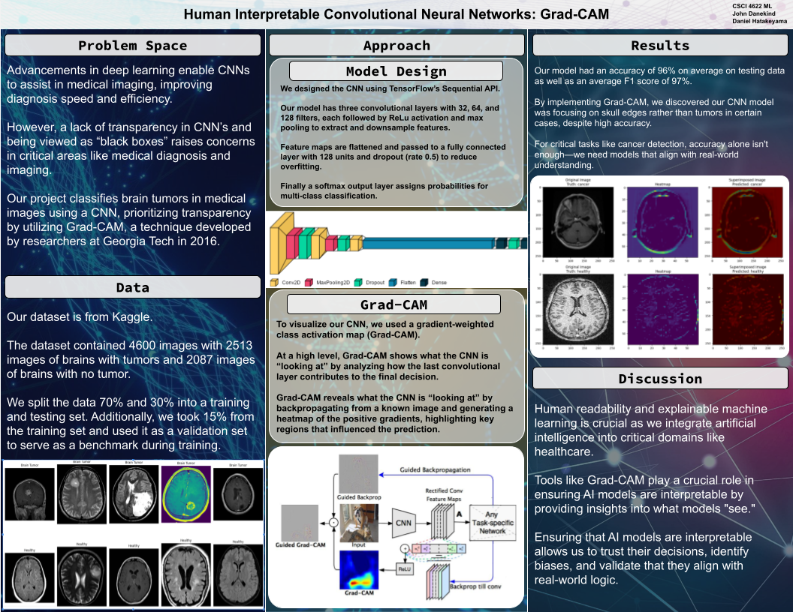

# Brain Tumor Classification with Grad-CAM  
### _Interpretable Deep Learning for Medical Imaging_
#### By **John Danekind** & **Daniel Hatakeyama** 
---
## Poster 

## Overview
This project demonstrates the use of **Grad-CAM (Gradient-weighted Class Activation Mapping)**<a href="#source1">[1]</a> to interpret a **Convolutional Neural Network (CNN)**<a href="#source1=2">[2]</a> trained for brain tumor classification. The goal is to visualize which regions of the input image the model focuses on when making predictions, providing insights into its decision-making process.

While CNNs can achieve high accuracy, our work demonstrates that **even seemingly strong models may lack a true understanding of the input data.** Using **AI explainability techniques** like Grad-CAM provide critical insights into a model's decision-making process to **make AI more transparent and understandable.**

For a quick overview of the project, check out the poster above or download it [here](images/gradcam-poster.png). Alternatively, check out the full implementation in the [Jupyter Notebook](brain-tumor-classification-gradcam.ipynb).

## Key Features
- **CNN Model**: A custom CNN trained on brain tumor MRI images.<a href="#source3">[3]</a> While we use our own architecture, Grad-CAM is compatible with any keras CNN.
- **Grad-CAM**: Visualizes model attention and highlights regions contributing to predictions.
- **Results**: Includes interpretable heatmaps that reveal whether the model focuses relevant regions or irrelevant artifacts.

## Requirements
See the full list in the `requirements.txt` file.

## Results
Here are some example Grad-CAM heatmaps generated by our model:

## License
This project is licensed under the MIT License. See the [LICENSE](LICENSE) file for details.

---

## Questions or Feedback?
Feel free to reach out or open an issue! Contributions and suggestions are welcome.

## Sources
1.  [Grad-CAM: Visual Explanations from Deep Networks](https://arxiv.org/abs/1610.02391) - Original Grad-CAM research paper.
2.  [Convolutional Neural Network Wikipedia](https://en.wikipedia.org/wiki/Convolutional_neural_network) - CNN Overview.
3.  [Kaggle Brain Tumor Dataset](https://www.kaggle.com/https://www.kaggle.com/code/boneacrabonjac/brain-tumor-classification-with-simple-cnn) - Brain tumor MRI data.
4.  [PyTorch Grad-CAM Repository](https://github.com/jacobgil/pytorch-grad-cam) - Inspired Implementation of Grad-CAM